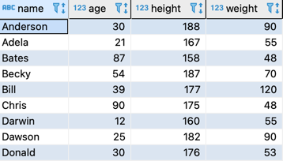

# 자르기
## 1. 자르기와 파티션
### 인물 테이블


#### 1-1. 사람들의 이름 앞 글자를 사용해 명단을 집계


```roomsql
select substring(name, 1,1) as label,
       count(*)
  from persons
 group by substring(name, 1,1);
```

#### 1-2. 나이로 자르기


```roomsql
select case when age < 20 then '어린이'
            when age between 20 and 69 then '성인'
            when age >= 70 then '노인' end as age_class,
       count(*)
  from persons
 group by case when age < 20 then '어린이'
            when age between 20 and 69 then '성인'
            when age >= 70 then '노인' end; 
```
- 주의할 점: postgreSQL, MySQL은 별칭을 이용해 'GROUP BY age_class'를 사용할 수 있는데 표준에 없는 내용이므로 주의 해야 한다. 

- 실행 계획


- GROUP BY 구에서 CASE 식 또는 함수를 사용해도 실행 계획에는 영향이 없다.
__집약 함수와 GROUP BY의 실행 계획은 성능적인 측면에서, 해시(또는 정렬)에 사용되는 워킹 메모리의 용량에 주의하라는 것 이외에는 따로 없다.__

#### 1-3. BMI로 자르기
__BMI = w / t^2__


```roomsql
select name as "이름",
       weight / power(height/ 100, 2) as "BMI",
       case when weight / power(height/ 100, 2) >= 25 then '과체중'
	        when weight / power(height/ 100, 2) between 18.5 and 25 then '정상'
	        when weight / power(height/ 100, 2) < 18.5 then '저체중' end as "분류"
  from persons;
```

```roomsql
select case when weight / power(height/ 100, 2) >= 25 then '과체중'
	        when weight / power(height/ 100, 2) between 18.5 and 25 then '정상'
	        when weight / power(height/ 100, 2) < 18.5 then '저체중' end as "BMI",
	   count(*)
  from persons 
 group by case when weight / power(height/ 100, 2) >= 25 then '과체중'
	           when weight / power(height/ 100, 2) between 18.5 and 25 then '정상'
	           when weight / power(height/ 100, 2) < 18.5 then '저체중' end;
```

## 2. PARTITION BY 구를 사용한 자르기
- GROUP BY 구에서 집약 기능을 제외하고 자르는 기능만 남긴 것이 윈도우 함수의 PARTITION BY 구
- 실제로 GROUP BY 구와 PARTITION BY 구의 실질적인 기능에는 차이가 없다.
- PARTITION BY 구를 사용해도 단순한 필드 이름뿐만 아니라 CASE 식, 계산 식을 사용한 복잡한 기준을 사용할 수 있다.

### 2-1. PARTITION BY 구를 이용해 같은 연령 등급에서 나이 어린 순서로 순위 매기기

```roomsql
select name, age,
       case when age < 20 then '어린이'
            when age between 20 and 69 then '성인'
            when age >= 70 then '노인' end as age_class,
       rank() over(partition by 
                           case when age < 20 then '어린이'
                                when age between 20 and 69 then '성인'
                                when age >= 70 then '노인' else null end
                       order by age) as age_rank_in_class
  from persons
 order by age_class desc, age_rank_in_class;
```