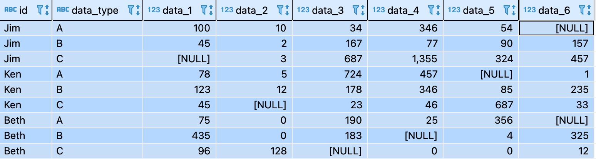
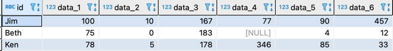
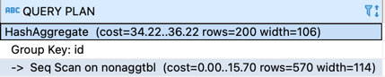
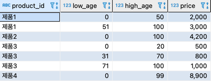
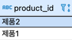
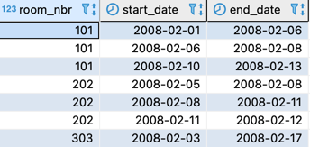
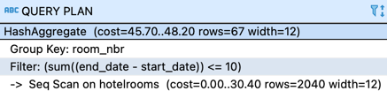

# 집약

- COUNT
- SUM
- AVG
- MAX
- MIN
## 1. 여러 개의 레코드를 한 개의 레코드로 집약



### 위 그림에서 
- data_type이 A인 경우 data_1,  
- data_2 data_type이 B인 경우 data_3, data_4, data_5 
- data_2 data_type이 C인 경우 data_6를 사용하는 테이블을 표현


- 먼저 Group by 의 집약 키는 id
- 선택할 필드를 data_type 필드로 분기

**GROUP BY 구로 집약했을떄 SELECT 구에 입력할 수 있는 것**
- 상수
- GROUP BY 구에서 사용한 집약 키
- 집약 함수
```roomsql
select id, 
       max( case when data_type = 'A' then data_1 else null end) as data_1 , 
       max( case when data_type = 'A' then data_2 else null end) as data_2 , 
       max( case when data_type = 'B' then data_3 else null end) as data_3 , 
       max( case when data_type = 'B' then data_4 else null end) as data_4 , 
       max( case when data_type = 'B' then data_5 else null end) as data_5 , 
       max( case when data_type = 'C' then data_6 else null end) as data_6 
  from NonAggTbl
 group by id;
```
- 실행 계획


- 풀 스캔 후 GROUP BY로 집약 조작에 '해시' 알고리즘을 사용하고 있다.
  (정렬을 사용하는 겨우 'SORT GROUP BY(오라클)' )
- 해시는 GROUP BY 구에 지정되어 있는 필드를 해시 함수를 사용해 해시키로 변환하고, 같은 해시 키를 가진 그룹을 모아 집약하는 방법이다.
__해시의 성질상 GROUP BY의 유일성이 높으면 더 효율적으로 작동 한다.__
- 주의할 점: 정렬과 해시 모두 메모리를 많이 사용하므로, 충분한 해시용 워킹 메모리가 확보되지 않으면 스왑이 발생한다. 

## 2. 합쳐서 하나
### 2-1. 연령별 가격 테이블

- 0~100세 까지 모두가 가지고 놀 수 있는 제품 구하기


```roomsql
select product_id
  from pricebyage
 group by product_id 
having sum(high_age - low_age + 1) = 101;
```
### 2-2. 호텔 테이블


- 사람들이 숙박한 날이 10일 이상인 방
```roomsql
select room_nbr,
       sum(end_date - start_date) as working_days
  from hotelrooms 
 group by room_nbr
having sum(end_date - start_date) >= 10;
```
- 실행 계획

