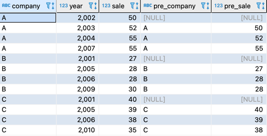
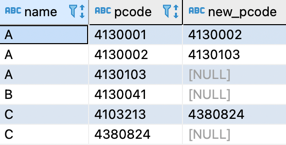

b#SQL 반복문 표현
## 1. 포인트는 CASE 식과 윈도우 함수
- Sales 테이블


- Sales 테이블을 이용하여 Sales2 테이블 값 넣기


```roomsql
insert into sales2 
select company,
       year,
       sale,
       case sign(sale - max(sale) 
                           over (partition by company
                                    order by year
                                     rows between 1 preceding
                                              and 1 preceding))
       		when 0 then '='                                              
      		when 1 then '+'                                              
       		when -1 then '-' else null end as var 
  from sales;
```
- sign 함수: 숫자 자료형을 매개변수로 받아 음수라면 -1, 양수 1, 0 이라면 0을 리턴
- rows between 1 preceding and 1 preceding: 직전의 1개로 레코드를 제한


- 실행 계획: 윈도우 함수를 정렬로 실행한다. 현재 select 구문은 결합을 사용하지 않는다. 따라서 테이블의 레코드 수가 증가해도 실행 계획에 별다른 영향을 주지 않으므로 안정적이다.
- 윈도우 함수로 '직전 회사명'과 '직전 매상'을 검색


```roomsql
select company, year, sale,
       max(company) 
          over(partition by company 
                   order by year 
                    rows between 1 preceding 
                             and 1 preceding ) as pre_company,
       max(sale) 
          over(partition by company 
                   order by year 
                    rows between 1 preceding 
                             and 1 preceding ) as pre_sale
  from sales;
```
- 서브쿼리

```roomsql
SELECT company,
       year,
       sale,
       (select company
          from sales s2
         where s1.company = s2.company
           and year = (select max(year)
                         from sales s3
                        where s1.company = s3.company
                          and s1.year > s3.year)) as pre_company,
       (select sale
          from sales s2
         where s1.company = s2.company
           and year = (select max(year)
                         from sales s3
                        where s1.company = s3.company
                          and s1.year > s3.year)) as pre_sale
 FROM Sales s1;
```

## 2. 최대 반복 횟수가 정해진 경우
- 포장계로 문제를 해결하는 예제
### 2-1. 인접한 우편 번호 찾기
- 반복문을 이용하지 않기 위해 순위 매겨서 구한다.

```roomsql
select pcode, district_name,
       case when pcode = '4130033' then 0
            when pcode LIKE '413003%' then 1
            when pcode LIKE '41300%'  then 2
            when pcode LIKE '4130%'   then 3
            when pcode LIKE '413%'    then 4
            when pcode LIKE '41%'     then 5
            when pcode LIKE '4%'      then 6
            else null end as rank
  from postalcode;
```
- 상위 3개


```roomsql
select pcode, district_name 
  from postalcode
 where case when pcode = '4130033' then 0
            when pcode LIKE '413003%' then 1
            when pcode LIKE '41300%'  then 2
            when pcode LIKE '4130%'   then 3
            when pcode LIKE '413%'    then 4
            when pcode LIKE '41%'     then 5
            when pcode LIKE '4%'      then 6
            else null end = 
                             (select min(case when pcode = '4130033' then 0
                                              when pcode LIKE '413003%' then 1
                                              when pcode LIKE '41300%'  then 2
                                              when pcode LIKE '4130%'   then 3
                                              when pcode LIKE '413%'    then 4
                                              when pcode LIKE '41%'     then 5
                                              when pcode LIKE '4%'      then 6
                                              else null end)
                                from postalcode);
```
- 실행 계획: 순위의 최솟값을 서브쿼리에섯 찾기 때문에 풀 스캔이 2회 일어난다.


- 윈도우 함수를 사용한 스캔 횟수 감소
```roomsql
select pcode,
       district_name 
  from (select pcode,
  			   district_name,
  			   case when pcode = '4130033' then 0
           		    when pcode LIKE '413003%' then 1
                    when pcode LIKE '41300%'  then 2
                    when pcode LIKE '4130%'   then 3
                    when pcode LIKE '413%'    then 4
                    when pcode LIKE '41%'     then 5
                    when pcode LIKE '4%'      then 6
                    else null end as hit_code,
                min(case when pcode = '4130033' then 0
				         when pcode LIKE '413003%' then 1
				         when pcode LIKE '41300%'  then 2
				         when pcode LIKE '4130%'   then 3
				         when pcode LIKE '413%'    then 4
				         when pcode LIKE '41%'     then 5
				         when pcode LIKE '4%'      then 6
				         else null end)
				over(order by case when pcode = '4130033' then 0
						           when pcode LIKE '413003%' then 1
						           when pcode LIKE '41300%'  then 2
						           when pcode LIKE '4130%'   then 3
						           when pcode LIKE '413%'    then 4
						           when pcode LIKE '41%'     then 5
						           when pcode LIKE '4%'      then 6
						           else null end ) as min_code
	     from postalcode) Foo
 where hit_code = min_code;
```

- 실행 계획: select 구문에서 사용하는 필드에 모두 인덱스가 포함되어 있을 때, 테이블 스캔을 하지 않고 인덱스를 사용한 접근만 실행 할 수 있다. 그리하여 테이블 접근이 1회로 감소한 것을 확인 할 수 있다. 그런데 윈도우 함수를 사용해서 정렬이 추가로 사용되었다. 


## 3. 반복 횟수가 정해지지 않은 경우
### 3-1. 인접 리스트 모델과 재귀 쿼리
- 현재 주소(우편번호) 뿐만 아니라 과거에 살던 주소 관리하는 테이블
- A는 4130001 -> 4130002 -> 4130003 으로 이사해서 살고 있다.



#### 1. 재귀 공통 테이블 식(recusion common table expression)을 사용해서 SQL에서 계층 구조 찾기
```roomsql
with recursive explosion (name, pcode, new_pcode, depth)
  as
(select name, pcode, new_pcode, 1
  from postalhistory 
 where name = 'A' and 
       new_pcode is null
union
select child.name, child.pcode, child.new_pcode, depth + 1
  from explosion as parent, postalhistory as child
 where parent.pcode = child.new_pcode and 
       parent.name = child.name)
select name, pcode, new_pcode 
  from explosion 
 where depth = (select max(depth)
                  from explosion); 
```
- A씨의 현재 주소(null을 가지고 있는 부분) 부터 출발해서 포인터 체인을 타고 올라가 과거의 주소를 모두 찾는다. 이 때 depth 필드가 가장 큰 것이 가장 재귀 수준이 깊다는 것이다.

- 실행 계획: 'Recursion Union'이 재귀 연산을 의미, 중간에 'WorkTable'이라는 말이 나오는데 이는 Explosion 뷰에 여러 번 접근하므로 일시 테이블로 만들었다는 것을 나타낸다. 이렇게 만들어진 일시 테이블과 원래 PostalHistory 테이블은, 인덱스 'idx_new_pcode'를 사용해 Nested Loops를 수행하므로 꽤 효율적인 계획이다.


#### 2. 중첩 집합 모델 


- 추가되는 노드의 왼쪽 끝 좌표 = (plft * 2 + prgt) / 3
- 추가되는 노드의 오른쪽 끝 좌표 = (plft + prgt * 2) / 3


```roomsql
select * 
  from postalhistory2 ph1
 where name = 'A'
   and not exists
       (select * 
          from postalhistory2 ph2
         where ph2.name = 'A' and
               ph1.lft > ph2.lft); 
```
- 실행 계획
