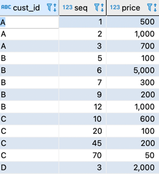
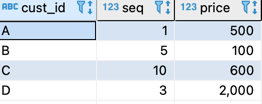
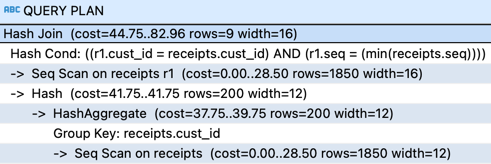
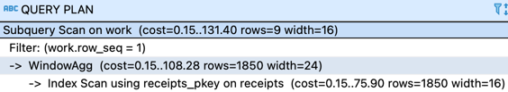
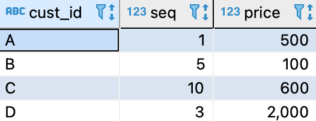
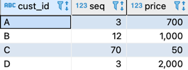
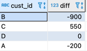
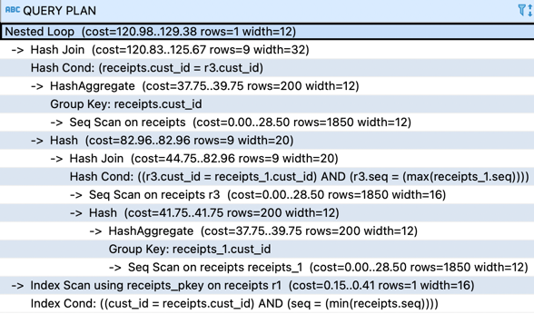
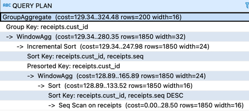

# 서브쿼리가 일으키는 폐해
## 1. 서브쿼리의 문제점
### 1-1. 연산비용 추가
- 실체적인 데이터를 저장하고 있지 않기 때문에 서브쿼리에 접근할 때마다 Select 구문을 실행해서 데이터를 만들어야 한다. 따라서 서브쿼리의 내용이 복잡하면 복잡할수록 이러한 실행 비용은 높아진다.
### 1-2. 데이터 I/O 비용 발생
- 연산 결과를 어딘가에 저장하기 위해 써두어야 한다. 메모리 용량이 충분하다면 이러한 오버헤드가 적지만, 데이터양이 큰 경우 DBMS가 저장소에 있는 파일에 결과를 쓸 떄도 있다. 그렇게 되면 저장소 성능에 따라 접근 속도가 급격하게 떨어진다.
### 1-3. 최적화를 받을 수 없음
- 서브쿼리로 만들어지는 데이터는 구조적으로 테이블과 차이가 없다. 하지만 명시적인 제약 또는 인덱스가 작성되어 있는 테이블과 달리, 서브쿼리에는 그러한 메타 정보가 하나도 존재하지 않는다. 따라서 옵티마이저가 쿼리를 해석하기 위해 필요한 정보를 서브쿼리에서는 얻을 수 없다.

__그렇기 때문에 서브쿼리는 해당 내용이 정말 서브쿼리를 사용하지 않으면 구현할 수 없는 것인지를 항상 생각해야 한다.__

## 2. 서브쿼리 의존증
- 구입 명세 테이블



- 규칙성 없는 아래 그림처럼 만들 SQL문?



```roomsql
select r1.cust_id, r1.seq, r1.price
  from receipts r1 inner join 
       (select cust_id, min(seq) as min_seq
          from receipts  
         group by cust_id) r2 
       on r1.cust_id = r2.cust_id and 
          r1.seq = r2.min_seq;
```
- 실행계획

- R1, R2에 각각에 대해 스캔이 이루어 지고 Hash 결합이 이루어 진다. Receipts테이블에 2회 접근한다.
- 아래의 상관쿼리도 테이블에 두번 접근이 일어난다.
```roomsql
select cust_id, seq, price
  from receipts r1 
 where seq = (select min(seq)
                from receipts r2
               where r1.cust_id = r2.cust_id);
```

- 단점
  1. 가독성이 떨아진다.
  2. 서브쿼리는 대부분 일시적인 영역(메모리 또는 디스크)에 확보되므로 오버헤드가 생긴다.
  3. 서브쿼리는 인덱스 또는 제약 정보를 가지지 않기 때문에 최적화되지 못한다.
  4. 서브쿼리는 결합을 필요로 하기 때문에 비용이 높고 실행 계획 변동 리스크가 발생한다.
  5. Receipts 테이블에 스캔이 두번 필요하다.

- 윈도우 함수로 결합을 제거
```roomsql
select cust_id, seq, price
  from (select cust_id, seq, price,
               rank() over(partition by cust_id 
                               order by seq ) as row_seq 
         from receipts) as work
 where work.row_seq = 1;
```
- 실행계획: Receipts 테이블에 대한 접근이 1회로 감소했다. 윈도우 함수에서 정렬을 사용하는 것이 추가 되긴 했지만 다른 코드들에서 min함수를 사용했었으므로, 큰 비용 차이가 발생하지는 않는다.


## 3. 장기적 관저멩서 리스크 관리
- 결합을 사용한 쿼리의 두 개의 불안정 요소
  1. 결합 알고리즘의 변동 리스크
  2. 환경 요인에 의한 지연 리스크(인덱스, 메모리, 매개변수 등)
  
### 3-1. 알고리즘 변동 리스크
- 레코드 수가 적은 테이블에서는 Nested Loops가 선택되기 싶고, 큰 레이블들을 결합하는 경우에는 Hash, SortMerge가 선택될 수 있다. 따라서 처음에는 Nested Loops를 사용하다가도 시스템을 계속 운용하면 레코드수가 늘어나 실행 계획에 변동이 생긴다. 좋아지는 경우도 있지만 오히려 악화되는 경우도 많다. 결국 결합을 사용하면 이러한 변동 리스크를 안을수 밖에 없다. 또한 같은 실행 계획을 계속해 선택되는 경우에도 문제가 있다. Sort Merge 또는 Hash에 필요한 메모리가 부족해지면 일시적으로 저장소를 사용하게 되므로 그 시점을 기준으로 성능이 대폭 떨어지게 된다.
### 3-2. 환경 요인에 의한 지연 리스크
- 결합을 사용한다는 것은 곧 장기적인 관점에서 고려해야 할 리스크를 늘리게 된다는 뜻이다.
### 3-3. 기억해야 될 점
1. 실행 계획이 단순할수록 성능이 안정적이다.
2. 엔지니어는 기능(결과) 뿐만 아니라 비기능적인 부분(성능)도 보장할 책임이 있다.

## 4. 서브쿼리 의존증 - 응용편
- cust_id 중 seq 가장 작은 값



- cust_id 중 seq 가장 큰 값


- seq 가장 큰 값에서 가장 작은 값의 price를 뺀 경우


1. 서브쿼리 이용
```roomsql
SELECT TMP_MIN.cust_id,
       TMP_MIN.price - TMP_MAX.price AS diff
 FROM (SELECT R1.cust_id, R1.seq, R1.price
          FROM Receipts R1
                 INNER JOIN
                  (SELECT cust_id, MIN(seq) AS min_seq
                     FROM Receipts
                    GROUP BY cust_id) R2
            ON R1.cust_id = R2.cust_id
           AND R1.seq = R2.min_seq) TMP_MIN
       INNER JOIN
       (SELECT R3.cust_id, R3.seq, R3.price
          FROM Receipts R3
                 INNER JOIN
                  (SELECT cust_id, MAX(seq) AS min_seq
                     FROM Receipts
                    GROUP BY cust_id) R4
            ON R3.cust_id = R4.cust_id
           AND R3.seq = R4.min_seq) TMP_MAX
    ON TMP_MIN.cust_id = TMP_MAX.cust_id;
```
1-2. 실행 계획

  - 테이블의 접근 4번, 환경에 따라 기본 키의 인덱스를 사용해서 접근할 수도 있다. 하지만 접근 횟수가 많다는 점은 그대로 이다.

2. 윈도우 함수와 case 식 이용
```roomsql
select cust_id,
       sum(case when a.min_seq = 1 then price else 0 end) - 
       sum(case when a.max_seq = 1 then price else 0 end) as diff
  from (select cust_id, seq, price, 
               rank() over(partition by cust_id 
                       order by seq) as min_seq,
               rank() over(partition by cust_id 
                       order by seq desc) as max_seq
          from receipts) a 
 group by cust_id  ;
```
- 서브 쿼리는 a 하나 뿐이다. 그리고 결합도 발생하지 않는다. 


- 테이블의 스캔 횟수 1회, 정렬이 2회 발생 하는 부분에서 비용은 들지만 결합을 반복하는 것보다는 저렴하고 실행 계획의 안정성도 확보할 수 있다.


