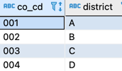
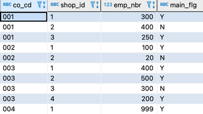
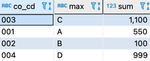
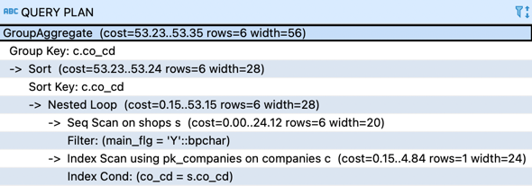
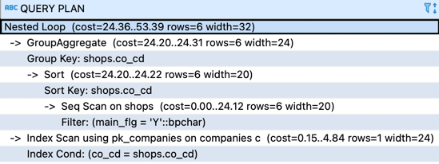

# 서브쿼리 사용이 더 나은 경우
## 1. 결합과 집약 순서
- 회사 테이블


- 사업소 테이블



- 주요 사업소의 직원 수(main_flg 가 'Y')


### 두가지 방법
1. 결합부터 하고 집약을 하는 방법
```roomsql
select c.co_cd, max(c.district), sum(emp_nbr)
  from companies c inner join  
       shops s 
       on c.co_cd = s.co_cd 
 where main_flg = 'Y'
 group by c.co_cd;
```
- 실행계획
  - 회사 테이블과 사업소 테이블의 결합(Nested Loop)을 먼저 수행하고, 결과에 GROUP BY를 적용해서 집약(GroupAggregate)했다. 
  - 결합 대상 레코드 수: 회사 테이블 4개, 사업소 테이블: 10개
  



2. 집약을 먼저 하고 결합하는 방법
```roomsql
select c.co_cd, c.district, sum_emp
  from companies c inner join  
       (select co_cd,
       		   sum(emp_nbr) as sum_emp
       	  from shops 
       	 where main_flg = 'Y'
       	 group by co_cd) CSUM
       on c.co_cd = CSUM.co_cd;
```
- 실행계획
  - 먼저 사업소 테이블을 집약(GroupAggregate)해서 직원 수를 구하고, 회사 테이블과 결합(Nested Loop)했다. 
  - 결합 대상 레코드 수: 회사 테이블 4개, 사업소 테이블: 4개
  - 첫번째 방법 10개 보다 작으므로 결합 비용을 낮출 수 있다. 이렇게 회사 테이블 규모에 비해 사업소 테이블의 규모가 매우 크다면, 일단 결합 대상 레코드 수를 집약하는 편이 I/O 비용을 줄일 수 있다. 물론 두 번째 방법에서는 집약 비용이 첫 번째 방법보다 크다.



### 중요 
1. 서브쿼리는 복잡한 문제를 분해할 수 있는 편리한 도구지만, 결합을 늘리는 성능 악화를 일으 킬 수 있음
2. SQL 성능을 결정한는 요인은 I/O가 절대적
3. 서브쿼리와 결합을 윈도우 함수로 대체하면 성능을 개선할 가능성이 있음
4. 서브쿼리를 사용할때는 결합 대상 레코드 수를 사전에 압축해서 성능을 개선할 수 있음