# 레코드에 순번 붙이기 응용
## 1. 중앙값 구하기
- 중앙값이란 숫자를 정렬하고 양쪽 끝에서부터 수를 세는 경우 정중앙에 오는 값이다. 단순 평균(mean)과는 다르게 극단적으로 벗어나 있는 예외적인 수에 영향을 받지 않는다.

- 체중 테이블 (홀수: 중앙값 = 60)

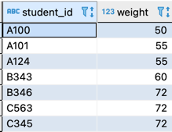

- 체중 테이블 (짝수: 중앙값 = 57.5)
  - 중앙에 있는 두개의 값 평균
  - (55 + 60) / 2 = 57.5
  
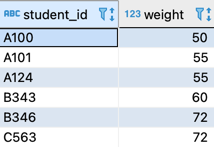

- 홀수 인 경우 중앙값

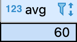

### 1-1. 집합지향적인 방법
- 테이블을 상위 집합과 하위 집합으로 분할하고 그 공통 부분을 검색하는 방법


```roomsql
select avg(weight)
  from (select w1.weight 
          from weights w1, weights w2
         group by w1.weight
        having sum (case when w2.weight >= w1.weight then 1 else 0 end )
                    >= count(*) / 2
           and sum (case when w2.weight <= w1.weight then 1 else 0 end )
                    >= count(*) / 2) tmp;        
```
- having 구안의 case 식에 표현한 두 개의 특성 함수로 모집합 weight를 상위 집합과 하위 집합으로 분할 한다. 외측의 AVG 함수는 테이블의 레코드 수가 짝수일 때 평균을 계산하기 위해 사용하는 것이다. 
- 실행계획
  - Nested Loops가 나타나는 것을 보면 알 수 있듯이 w1 또는 w2에 결합이 수행된다. 이 두개의 테이블은 같은 weight 테이블이므로 결국 자기 결합을 수행하는 것이다. 

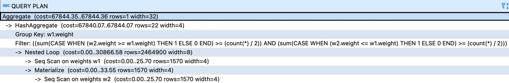

### 1-2. 절차 지향적 방법1
- 양쪽 끝부터 숫자 세기를 사용
```roomsql
select avg(weight) as median
  from (select weight, 
  			   row_number() over(order by weight asc, student_id asc) as hi,
  			   row_number() over(order by weight desc, student_id desc) as lo
  	      from weights ) tmp 
 where hi in (lo, lo+1, lo-1)
```
- 주의할 점
  - 홀수인 경우 hi=lo가 되어 중심점이 반드시 하나만 존재할 것이다. 짝수인 경우 hi=lo+1 과 hi=lo-1의 두 개가 존재한다. 조건 분기를 in 연산자로 한꺼번에 수행했다. 
  - RANK, DENSE_RANK 함수는 예외가 생기므로 ROW_NUMBER 함수를 사용해야 한다. (연속성, 유일성 지킬 수 있다.)
  - ORDER BY의 정렬 키에 weight 필드뿐만 아니라 기본 키인 student_id도 포함해야 한다. student_id를 포함하지 않으면 결과가 null이 될 수도 있기 때문이다.

- 실행계획
  - weight 테이블에 대한 접근이 1회로 감소하고 결합이 사용되지 않는 다는 것을 알 수 있다. 그 대신 ROW_NUMBER를 두번 사용하였기 때문에 정렬이 2회로 보인다. 집합 지향적 코드와 비교하면 결합을 제거한 대신 정렬이 1회 늘어났다고 볼 수 있다. weights 테이블이 충분히 클 경우 이런 트레이드오프는 이득이다.
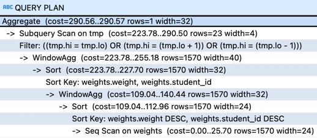

### 1-3. 절차 지향적 방법2
- 2빼기 1은 1
  - ROW_NUMBER를 사용한 방법은 굉장히 깔끔하지만 성능적으로 이런 방법이 가장 좋다고는 말할 수 없다. 

- 성능적으로 개선한 코드
  - 서브 쿼리 부분: ROW_NUMBER 함수로 구한 순번을 2배 해서 diff 를 구하고, 거기에서 count(*) 을 빼는 것이다. 이후에 diff 가 0~2인 값을 찾고, 평균을 구하는 것이므로 중간값은 60이 된다.

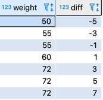

```roomsql
select weight, 
       2*row_number() over(order by weight) 
       - count(*) over() as diff
 from weights) tmp 
```


```roomsql
select avg(weight)
  from (select weight, 
               2*row_number() over(order by weight) 
               - count(*) over() as diff
          from weights) tmp 
 where diff between 0 and 2;
```
- 실행계획
  - count 함수의 over() 구문에 order by 가 없으므로  정렬이 1회 줄어 들었다. 벤더의 독자적인 확장 기능에서 제공하는 중앙값 함수를 제외하면, 이 방법이 SQL 표준으로 중앙값을 구하는 가장 빠른 쿼리이다.
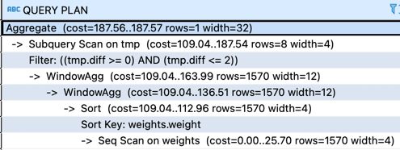

## 2. 순번을 사용한 테이블 분할
- 데이터를 특정 기준으로 그룹화하는 일
### 2-1. 단절 구간 찾기

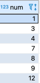

- 2-1-1. 집합 지향적 방법 -집합의 경계선
  - 집합 지향적인 방법은 반드시 자기 결합을 사용해야 한다. 

- 비어있는 숫자 모음을 표시 

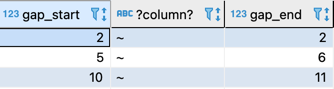


```roomsql
select (n1.num+1) as gap_start, '~',
       (min(n2.num)-1) as gap_end 
  from numbers n1 inner join numbers n2
       on n2.num > n1.num
 group by n1.num
having (n1.num+1) < min(n2.num);
```
- n2.num : 'n1.num 보다 큰 숫자의 집합'
- n1.num + 1 < min(n2.num) 를 이용해 단절이 있음을 찾는다.
  - n1.num + 1 다음의 숫자가 min(n2.num)과 일치하지 않음을 보고
  

- 실행계획: N1 과 N2 에 Nested Loops 로 결합이 일어나는 것을 확인할 수 있다.

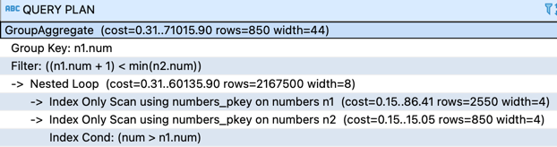

- 2-1-2. 절차 지향적 방법 -'다음 레코드' 와 비교
- 현재 레코드의 다음 레코드를 구하고, 이들 두 레코드의 숫자 차이를 diff 필드에 저장해 연산
- diff 가 1이 아니라면 사이에 비어있는 숫자가 존재한다는 의미
```roomsql
select num + 1 as gap_start, '~', 
       (num + diff - 1) as gap_end
  from (select num,
  	           max(num) over(order by num
  	                          rows between 1 following and 1 following ) - num
  	      from numbers) tmp(num, diff)
 where diff <> 1;
```

- 윈도우 함수만 따로 실행한 결과
```roomsql
select num,
       max(num) over(order by num
                      rows between 1 following and 1 following ) as nex_num
  from numbers;
```

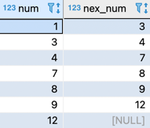

- 실행계획
  - numbers 테이블에 한 번만 접근이 발생하고 윈도우 함수에서 정렬이 실행된다. 결합을 사용하지 않으므로 성능이 굉장히 안정적이다.
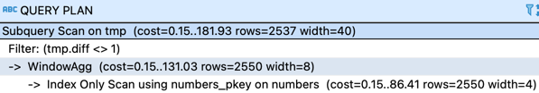

## 3. 테이블에 존재하는 시퀀스 구하기
- 지금까지는 __테이블에 존재하지 않는__ 시퀀스를 찾았다. 이번에는 반대로 테이블에 존재하는 수열을 그룹화하는 방법을 한다. 친구 또는 가족 인원수에 맞겍 자리를 예약하고 싶은 경우에는 이러한 덩어리를 구할 수 있어야 한다.

### 3-1. 집합 지향적 방법 
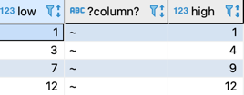

```roomsql
select min(num) as low, '~',
       max(num) as high
  from (select n1.num,
               count(n2.num) - n1.num
          from numbers n1 inner join numbers n2
               on n2.num <= n1.num 
         group by n1.num) N(num, gp)
 group by gp
```
- 서브쿼리의 N(num, gp)의 num, gp는 1,2번쨰 컬럼에 이름을 부여하는 것이다.
-실행계획

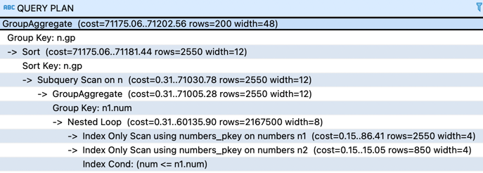

### 3-2. 절차 지향적 방법 -'다음 레코드 하나'와 비교 
- 현재 레코드와 전후의 레코드에 있는 num 필드의 차이 (TMP 1)
  
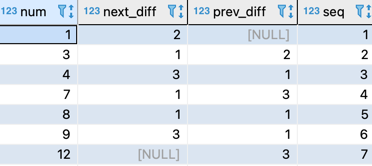

- 현재 레코드와 전후의 레코드에 있는 num 필드의 차이 (TMP 2)

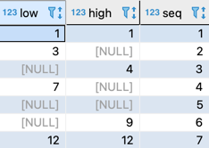

- 시퀀스 정리 (TMP 3)

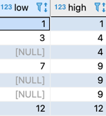

- low 필드가 NULL 인 레코드 제거

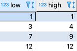

```roomsql
select low, high
  from (select low, 
               case when high is null 
                    then min(high) over(order by seq 
                                         rows between current row and 
                                                      unbounded following)
                    else high end as high
          from (select case when coalesce(prev_diff, 0) <> 1
                            then num else null end as low,
                       case when coalesce(next_diff, 0) <> 1
                            then num else null end as high,
                       seq
                  from (select num, 
                               max(num) over(order by num
                                              rows between 1 following and 
                                                           1 following) - num as next_diff, 
                               num - max(num) over (order by num 
                                                     rows between 1 preceding and 
                                                                  1 preceding) as prev_diff,
                               row_number() over (order by num) as seq
                          from numbers) tmp1) tmp2) tmp3    
 where low is not null;
```
- 실행계획

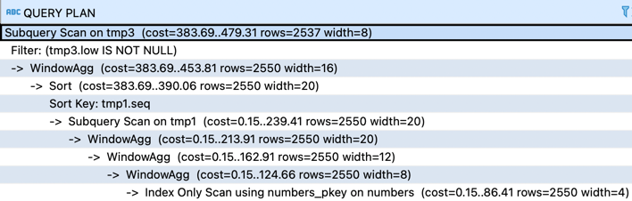