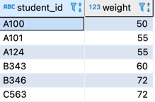
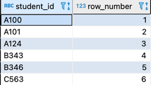
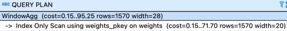
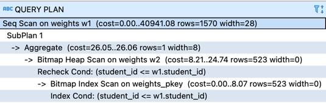
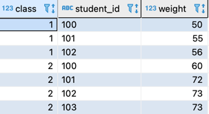
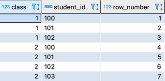
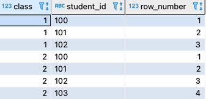
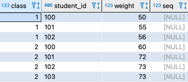
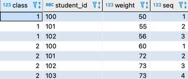

# 레코드에 순번 붙이기
## 1. 기본 키가 한 개의 필드일 경우
- 체중 테이블



### 1-1. 윈도우함수를 사용: 학생 ID를 오름차순으로 사용
```roomsql
select student_id , 
       row_number() over(order by student_id) 
  from weights;
```


- 실행계획: 스캔 횟수: 1회또 인덱스 온리 스캔을 사용하므로 테이블에 직접적인 접근을 회피한다.



###  1-2. 상관 서브쿼리를 사용: MySQL처럼 ROW_NUMBER 함수를 사용할 수 없는 경우
```roomsql
select student_id, 
       (select count(*)
          from weights w2
         where w2.student_id <= w1.student_id ) as seq
  from weights w1;
```

재귀 집합을 만들고 요소 수를 COUNT 함수로 센다. 기본 키 student_id를 비교 키로 사용하므로 재귀 집합의 요소가 한 개씩 증가한다. 순번을 생성할 때 자주 사용하는 트릭이다.

- 실행계획: 2회의 스캔이 실행된다.



## 2. 기본 키가 여러 개의 필드로 구성되는 경우
- 체중 테이블2
  - 기본키: 학급(class), 학생 ID(student_id)



### 2-1. 윈도우 함수를 사용


```roomsql
select class, student_id,
       row_number() over(order by class, student_id)
  from weights2; 
```

### 2-2. 상관 서브쿼리를 사용
  - 다중 필드 비교: 복합적인 필드를 하나의 값으로 연결하고 한꺼번에 비교하는 기능, 필드 자료형을 원하는대로 지정할 수 있다. 암묵적인 자료형 변환도 발생하지 않으므로 기본 키 인덱스도 사용할 수 있다. 또한 필드가 3개 이상일 때도 간단하게 확장할 수 있다.
```roomsql
select class, student_id,
       (select count(*) 
          from weights2 w2 
         where (w2.class, w2.student_id) <= (w1.class, w1.student_id)) as seq
  from weights2 w1; 
```

## 3. 그룹마다 순번을 붙이는 경우


### 3-1. 윈도우 함수 이용
```roomsql
select class, student_id,
       row_number() over(partition by class order by student_id ) 
  from weights2;
```

### 3-2. 상관 서브쿼리를 사용
```roomsql
select class, student_id,
       (select count(*) 
          from weights2 w2
         where w2.class = w1.class and 
               w2.student_id <= w1.student_id ) as seq
  from weights2 w1;
```

## 4. 순번과 갱신




### 4.1 윈도우 함수를 사용
  - 순번 할당 쿼리를 SET 구로 넣는 방법을 생각해 볼 수 있다. 그리고 ROW_NUMBER를 쓸 경우에는 서브쿼리를 함께 사용해야 한다.
```roomsql
update weights3 
   set seq = (select seq
               from (select class,student_id, weight,
			         		row_number() over(partition by class 
			                                      order by student_id) as seq
			       	  from weights3) seq_tbl
			  where weights3.class = seq_tbl.class and 
			        weights3.student_id = seq_tbl.student_id);
```

### 4.2 상관 서브쿼리를 사용
```roomsql
update weights3 			       
   set seq = (select count(*)
	     		from weights3 w2
			   where w2.class = weights3.class and
			         w2.student_id <= weights3.student_id);   
```  