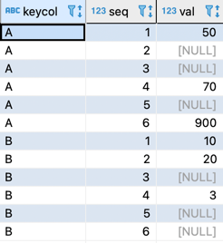
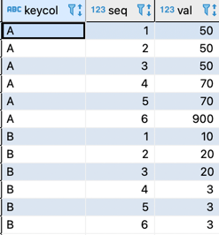
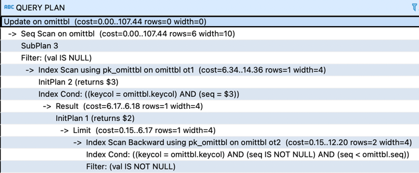

# 갱신은 효율적으로
## 1. NULL 채우기
- omittbl 채우기 이전 상태
  - keycol: 키, seq: 순번, val: 값



- omittbl 값을 채운 뒤 상태



- 상관 서브쿼리를 사용한 접근법
  1. 같은 keycol 필드를 가짐
  2. 현재 레코드보다 작은 seq 필드를 가짐
  3. val 필드가 NULL 이 아님
  
```roomsql
update omittbl 
set val = (select val 
		     from omittbl ot1
		    where ot1.keycol = omittbl.keycol and
		          ot1.seq = (select max(seq)
		                       from omittbl ot2
		                      where ot2.keycol = omittbl.keycol and 
		                            ot2.seq < omittbl.seq and
		                            ot2.val is not null))
 where val is null;		                           		                
```
- 실행계획
  - IS NULL 조건만 따지는 WHERE 구는 OmitTbl 테이블을 풀 스캔할 수 밖에 없다. 하지만 내부에 있는 2개의 서브쿼리는 테이블에 접근할 때 기본 키 인덱스를 사용하는 것으로 나타난다. 따라서 반복계에 비해 성능이 높을 수 있다. 



## 2. 반대로 NULL을 작성
- 위의 접근법 1~3에 해당하면 NULL을 입력하고, 그렇지 않은 레코드에는 val 값을 입력하는 분기를 case 식으로 나타낸것이다. 이러한 코드가 가능한 이유는 서브쿼리가 하나의 값을 리턴하는 스칼라 서브쿼리이기 때문이다.

```roomsql
update omittbl 
set val = case when val
        = (select val 
		     from omittbl ot1
		    where ot1.keycol = omittbl.keycol and
		          ot1.seq = (select max(seq)
		                       from omittbl ot2
		                      where ot2.keycol = omittbl.keycol and 
		                            ot2.seq < omittbl.seq ))
		       then null else val end;     
```
