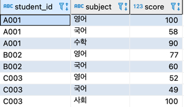
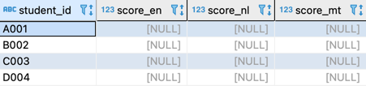
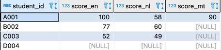
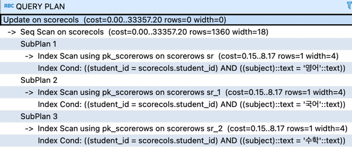
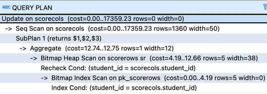
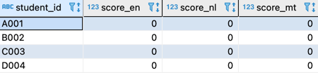

# 레코드에서 필드로의 갱신
- 점수를 레코드로 갖는 테이블 정의



- 점수를 필드로 갖는 테이블 정의



- scorecols 갱신 후



## 1. 필드를 하나씩 갱신

```roomsql
update scoreCols
set score_en = (select score 
                     from scorerows sr 
                    where sr.student_id = scoreCols.student_id
                      and subject = '영어'),
    score_nl = (select score 
                     from scorerows sr 
                    where sr.student_id = scoreCols.student_id
                      and subject = '국어'),
    score_mt = (select score 
                     from scorerows sr 
                    where sr.student_id = scoreCols.student_id
                      and subject = '수학');
```

- 실행계획: 서브쿼리가 3회 실행되는 것을 확인, 갱신하고 싶은 과목이 늘어날수록 서브쿼리도 많아지게 된다.



## 2. 다중 필드 할당
- 여러 개의 필드를 리스트화하고 한 번에 갱신하는 방법, 이렇게 하면 서브쿼리를 한꺼번에 처리할 수 있어 성능도 향상되고 코드도 간단해 진다. 또 이후에 갱신해야 할 필드의 수가 늘어나도, 서브쿼리의 수가 늘어나지 않으므로 성능적으로 악화될 염려가 없다.
- 다중 필드 할당
  - SET 구의 왼쪽을 보면 영어, 국어, 수학이라는 세개의 필드를 (score_en, score_nl, score_mt)와 같은 리스트 형식으로 지정했다. 이렇게 하면 리스트 전체를 하나의 조작 단위로 만들 수 있다. 이는 SQL-92에서 도입된 다중 필드 할당 기능 이다. 표준 SQL 기능이므로 아직 지원되지 않는 DB도 지원할 것으로 보인다.
- 스칼라 서브쿼리
  - 서브쿼리 내부를 보면 CASE 식으로 과목별 점수를 검색한다. 이때 중요한 것은 각각의 점수에 MAX 함수를 적용한다. ScoreRows 테이블에는 특정 학생의 레코드가 여러개 있으므로 집약하지 않으면 서브쿼리로 여러 개의 레코드가 리턴된다. 그렇기 때문에 MAX 함수를 적용해서 단일한 값을 리턴한다.
```roomsql
update scorecols   
   set (score_en, score_nl, score_mt)
       = (select max(case when subject = '영어' 
                          then score 
                          else null end) as score_en,
                 max(case when subject = '국어' 
                          then score 
                          else null end) as score_nl,
                 max(case when subject = '수학' 
                          then score 
                          else null end) as score_mt
            from scorerows sr
           where sr.student_id  = scoreCols.student_id);
```
- 실행계획 
  - ScoreRows 테이블에 대한 접근이 한 번으로 감소하는 것을 확인할 수 있다.
  - 상관 서브쿼리가 하나로 정리된 대신, ScoreRows 테이블에 대한 접근은 유일 검색(INDEX UNIQUE SCAN)이 아닌 범위 검색(INDEX RANGE SCAN)으로 변하고, MAX 함수의 정렬이 추가되는 트레이드오프가 일어 났다. 하지만 한 명의 학생당 과목 수가 그렇게 많지 않을 것이므로 서브쿼리를 줄이는 것이 훨씬 효율적인 트레이드 오프 이다.
  


## 3. NOT NULL 제약이 걸려있는 경우


- 두개의 코드는 두 단계에 걸쳐 NULL 에 대응한다.
  1. '처음부터 테이블 사이에 일치하지 않는 레코드가 존재한 경우' 학생 D004가 해당하는 부분, 외부의 WHERE 구의 EXISTS를 사용해 '2개의 테이블 사이에 학생 ID 가 일치하는 레코드로 한정' 이라는 조건을 추가
  2. '학생은 존재하지만 과목이 없는 경우' 학생 B002, C003의 수학 과목이 여기에 해당, 이는 COALESCE 함수로 NULL 을 0으로 변경해서 대응
```roomsql
update scoreColsNN
set score_en = coalesce((select score 
                     from scorerows sr 
                    where sr.student_id = scoreColsNN.student_id
                      and subject = '영어'),0),
    score_nl = coalesce((select score 
                     from scorerows sr 
                    where sr.student_id = scoreColsNN.student_id
                      and subject = '국어'),0),
    score_mt = coalesce((select score 
                     from scorerows sr 
                    where sr.student_id = scoreColsNN.student_id
                      and subject = '수학'),0)
 where exists (select * 
                 from scorerows
 			    where student_id = scoreColsNN.student_id);                     
```
```roomsql
update scorecolsnn   
   set (score_en, score_nl, score_mt)
       = (select coalesce(max(case when subject = '영어' 
                          then score 
                          else null end),0) as score_en,
                 coalesce(max(case when subject = '국어' 
                          then score 
                          else null end),0) as score_nl,
                 coalesce(max(case when subject = '수학' 
                          then score 
                          else null end),0) as score_mt
            from scorerows sr
           where sr.student_id = scoreColsnn.student_id)
 where exists (select * 
                 from scorerows
                where student_id = scorecolsnn.student_id);
```

