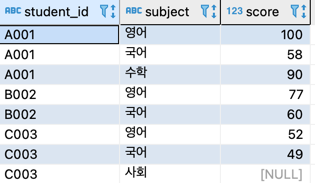

# 1. 필드에서 레코드로 변경


- ScoreRows 갱신 후의 점수 테이블
  - 학생별로 갱신 대상 레코드를 subject 값에 따라 분기 따라서 set 구의 서브쿼리 내부에 case 식을 사용해 분기한다.
  


```roomsql
update scorerows  
   set score = (select case scorerows.subject 
                       when '영어' then score_en
                       when '국어' then score_nl
                       when '수학' then score_mt else null end
                  from scorecols 
                 where student_id = scorerows.student_id);
```

- 실행계획
  - 테이블에 한번 접근후에 기본 키 인덱스가 사용되며 정렬과 해시도 없다. 성능적으로 더 이상 개선할  수 있을 여지가 없을 정도로 좋은 실행 계획이다.


# 2. 같은 테이블의 다른 레코드로 갱신

- 참조 대상 주가 테이블(trend 필드를 연산해서 INSERT)


- 갱신 대상 주가 테이블(비어있는 상태)


## 2-1. 상관 서브쿼리 사용
- 레코드끼리 비교할 때 사용하는 도구


```roomsql
insert into stocks2 
select brand, sale_date, price, 
       case sign(price - 
                 (select price 
                    from stocks s1 
                   where brand = stocks.brand and 
                         sale_date = (select max(sale_date) 
                                        from stocks s2 
                                       where brand = stocks.brand and 
                                             sale_date < stocks.sale_date)))
            when -1 then '↓'
            when 0 then '→'
            when 1 then '↑' end
  from stocks;
```

- 실행계획


## 2-2. 윈도우 함수 사용

```roomsql
insert into stocks2
select brand, sale_date, price, 
       case sign(price - 
                 max(price) over(partition by brand 
                                     order by sale_date
                                      rows between 1 preceding and 1 preceding))
       when -1 then '↓'
       when 0 then '→'
       when 1 then '↑' end
  from stocks;
```

- 실행계획
  - Stocks 테이블에 대한 접근도 풀 스캔 한 번으로 감소했다.


## 3. INSERT와 UPDATE 어떤 것이 좋을까?
- INSERT SElECT 의 두 가지 장점
  1. 일반적으로 UPDATE 에 비해 INSERT SELECT 가 성능적으로 나으므로 고속 처리를 기대할 수 있습니다.
  2. MySQL처럼 갱신 SQL에서의 자기 참조를 허가하지 않는 데이터베이스에서도 INSERT SELECT 는 사용할 수 있다.(참조 대상 테이블과 갱신 대상 테이블이 서로 다른 테이블이라는 부분이 포인트)

- INSERT 를 사용할 때의 단점
  1. 같은 크기와 구조를 가진 데이터를 두 개 만들어야 한다. 따라서 저장소 용량을 2배 이상 소비한다. 하지만 최근 저장소 가격이 낮아진 것을 생각하면 이를 그렇게 큰 단점이라고 하기도 애매하다.

- 뷰로 만드는 방법도 있다. 그렇게 하면 저장소 용량을 